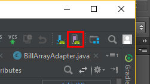
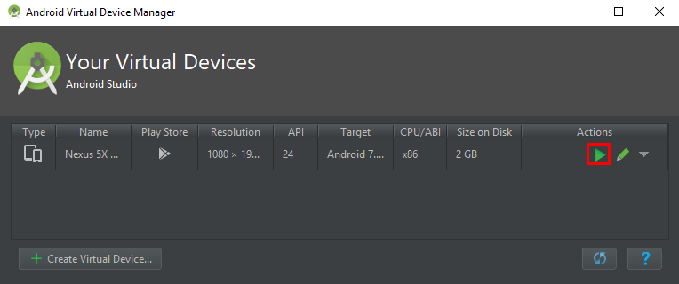
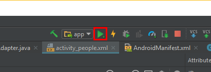

# Android Bill Splitter App
This application is built for a Epicodus project.

Application will allow you to add restaurant receipts and split the items by costs, display all guests that participated in the bill.

Note that the application is still in development.

**None Working Application At the moment!** 

## Getting Started

Software Required:

- [Android Studio 3.0.1](https://developer.android.com/studio/index.html)
- Android Device/Virtual Device with Google Play Services


1. Clone this repository to your local machine.
```
$ git clone https://github.com/thebyronc/AndroidBillSplitter
```
2. Open project *AndroidBillSplitter* with **Android Studio**
3. Click on **AVD Manager** in **Android Studio** 

4. Run a Virtual Device with an **API** of **24** or higher. 

5. Once Virtual Device is running, click **Run App**. 

6. App will run on **Virtual Device**''
## Current Status
This is still a work in progress. See Application Dev Plan

#### Application Research
- [Google OAuth 2.0](https://developers.google.com/identity/protocols/OAuth2) -Unique sign in for google drive
- [Google Sheets API](https://developers.google.com/sheets/api/) - Researching how to output information into google sheets and a personal record keeper.
- [Free OCR](http://www.free-ocr.com/) - Research how to parse text from images
- [Ocrad.js](http://antimatter15.com/ocrad.js/demo.html) - Possible text from image js

#### Application Dev Plan
- [x] Create Baseline objects and routers.
- [ ] Connect to Firebase for initial data creation and storage
- [ ] Implement OAuth2
- [ ] Connect individual sign-ins with Google Sheets
- [ ] Store parsed data into google sheets so the user can easily see and modify cost information.
- [ ] Re-pull from google sheets to get updated data.
- [ ] Possibly implement REACT Native to publish to Android and IOS
- [ ] Use Expo.io

| Objectives | Current Progress Details|
| --- | --- |
| Implement OAuth2 | Google Drive [OAuth 2.0](https://developers.google.com/identity/protocols/OAuth2)  |
|Google Sheets | Based on [REST](https://developers.google.com/sheets/api/reference/rest/) routes. GET and POST are used to add and retrieve data from Google Sheets.  |
| Use React Native | [React Native](http://facebook.github.io/react-native/): From initial research, React Native can be built in atom and angular.  |
| Expo.io | [Expo.io](https://expo.io/): Created sample phone application by using Expo to quickly deploy to my phone.|

### Author
**Byron Chang** - [Github](https://github.com/thebyronc/)
